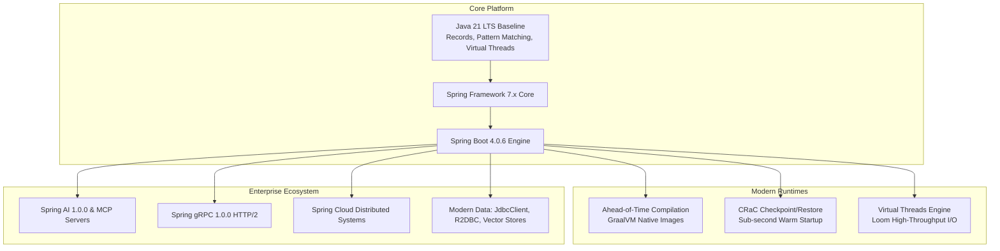
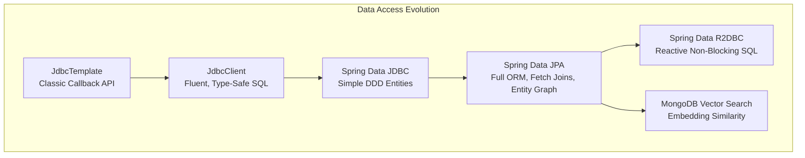
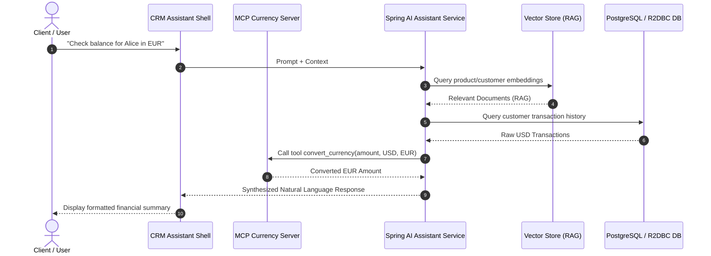

# Technical Deep Dive: Pro Spring Boot 4 Architecture, Enterprise Design Patterns & Build Engineering

---

## 1. Architectural Overview & The Spring Boot 4 Evolution

**Spring Boot 4.x** (built on top of **Spring Framework 7.x** and **Java 21 LTS baseline**) introduces fundamental shifts in enterprise Java engineering:



### Core Evolution Pillars in Spring Boot 4
1. **Java 21 as the Minimum Floor**: Deep integration of Java Records as DTOs and persistent models, sealed type hierarchies for domain modeling, pattern matching for switch/instanceof in controllers and error handlers, and virtual thread schedulers (`spring.threads.virtual.enabled=true`).
2. **Unified Data Access**: Introduction and standardization of `JdbcClient` as a fluent, type-safe alternative to `JdbcTemplate` without JPA overhead, alongside vector-native queries (`@VectorSearch`) in MongoDB and relational stores.
3. **AI & Agentic Systems**: Native integration of **Spring AI** and **Model Context Protocol (MCP)**, treating LLMs, tools, vector stores, and AI agents as first-class Spring beans.
4. **High-Performance Native & Cloud Deployment**: GraalVM Native Image compilation with automated Ahead-of-Time (AOT) analysis, explicit `RuntimeHintsRegistrar` configurations, and CRaC (Coordinated Restore at Checkpoint) lifecycle hooks.
5. **Modern RPC Baseline**: Standardized **Spring gRPC** starter replacing legacy third-party adapters for low-latency, binary-encoded microservice intercommunication.

---

## 2. Repository Topology: Dual-Stack Microservice Architecture

The `Pro-Spring-Boot-4-4th-ed` repository demonstrates every architectural pattern through a synchronized **Dual-Stack Customer vs. Management** archetype:

```mermaid
graph LR
    subgraph Customer Service (Maven / Imperative)
        C_API[Spring MVC / REST] --> C_SVC[Service Layer]
        C_SVC --> C_REPO[Spring Data JDBC / JPA / Mongo / JdbcClient]
        C_REPO --> C_DB[(PostgreSQL / H2 / MongoDB)]
    end

    subgraph Management Service (Gradle / Reactive & AI)
        M_API[Spring WebFlux / Router Functions] --> M_SVC[Reactive Service Layer]
        M_SVC --> M_REPO[R2DBC / Vector Repositories]
        M_REPO --> M_RDB[(PostgreSQL R2DBC / PGVector)]
        M_SVC --> M_AI[Spring AI / RAG / MCP Tools]
    end

    C_API <-->|gRPC / REST / Cloud Gateway| M_API
```

* **Customer Microservice (`customer`)**:
  * **Build Tool**: Apache Maven (`pom.xml`)
  * **Paradigm**: Imperative / Blocking (Spring MVC, Tomcat, Spring Data JDBC/JPA, standard transactions).
  * **Role**: Primary transactional business domain service.
* **Management Microservice (`management`)**:
  * **Build Tool**: Gradle 9.2+ (`build.gradle`)
  * **Paradigm**: Non-blocking / Reactive (Spring WebFlux, Netty, R2DBC, Spring AI Agents, MCP servers).
  * **Role**: High-throughput analytics, observability, AI agent automation, and cross-system orchestration.

---

## 3. Chapter-by-Chapter Technical Breakdown

```
Pro-Spring-Boot-4-4th-ed/
├── chapters/
│   ├── chapter-01-quick-start/          # WebMVC vs WebFlux Bootstrap
│   ├── chapter-02-internals/            # ApplicationContext, Lifecycle, AOP, Events
│   ├── chapter-03-web-development/      # Content Negotiation, Validation, ProblemDetail
│   ├── chapter-04-jdbc/                 # DataSource, Connection Pools (HikariCP), JdbcTemplate
│   ├── chapter-05-jdbc-client/          # Spring 6.1+ JdbcClient Fluent API
│   ├── chapter-06-spring-data/          # Spring Data JDBC vs Spring Data JPA
│   ├── chapter-07-nosql/                # MongoDB, Documents & Vector Search
│   ├── chapter-08-newsql-distributed/   # CockroachDB & Distributed Relational DBs
│   ├── chapter-09-reactive/             # R2DBC, WebFlux, Functional Endpoints
│   ├── chapter-10-testing/              # Testcontainers, MockMvc, WebTestClient
│   ├── chapter-11-security/             # Spring Security 7, OAuth2, Resource Servers
│   ├── chapter-12-messaging/            # Kafka, RabbitMQ, Event-Driven Architecture
│   ├── chapter-13-actuator/             # Micrometer, OpenTelemetry, Custom Indicators
│   ├── chapter-14-native-aot/           # GraalVM Native Image, Runtime Hints, CRaC
│   ├── chapter-15-spring-cloud/         # Gateway, Config Server, Distributed Tracing
│   ├── chapter-16-spring-ai/            # Spring AI, RAG, MCP Tools, Interactive Shell
│   └── chapter-17-extending/            # Custom Starter, AutoConfiguration, Conditions
└── appendix/
    └── grpc/                            # Spring gRPC 1.0.0 Protobuf Service
```

---

### Deep Dive: Foundational Chapters (01 – 04)

#### Chapter 1: Quick Start & Dual Dispatch
- **Customer (Maven)**: Initializes standard Tomcat container with Spring WebMVC. Demonstrates `@RestController`, immutable Java Record data models, and dependency injection via constructor parameters.
- **Management (Gradle)**: Demonstrates functional reactive endpoints (`RouterFunction<ServerResponse>`) and non-blocking Netty engine.

#### Chapter 2: Spring Boot Internals
- **AOP Proxies**: Implements `@Aspect` based method interception (`ControllerLoggingAspect`) measuring execution latency.
- **Strongly Typed Properties**: Uses `@ConfigurationProperties(prefix = "crm")` with immutable Record binding and JSR-380 validation (`@Validated`).
- **Application Events**: Demonstrates asynchronous event publication via `ApplicationEventPublisher` and `@EventListener` / `@TransactionalEventListener`.

#### Chapter 3: Web Development & RFC 7807 Problem Details
- **Validation**: Enforces `@Valid`, `@NotBlank`, and `@Email` constraints on incoming JSON payloads.
- **RFC 7807 Error Handling**: Centralizes error responses via `@RestControllerAdvice` returning `ProblemDetail` instances with standardized URIs, status codes, timestamps, and localized error messages.

#### Chapter 4: Core JDBC & Connection Pooling
- Configures **HikariCP** connection pool parameters (`maximumPoolSize`, `connectionTimeout`, `idleTimeout`).
- Evaluates transactional boundaries with `@Transactional(isolation = Isolation.READ_COMMITTED)`.

---

### Deep Dive: Modern Persistence Evolution (05 – 08)



#### Chapter 5: Spring `JdbcClient` Fluent API
Replaces legacy `JdbcTemplate` callbacks with the fluent query/update interface introduced in Spring Framework 6.1+:
```java
// Fluent query mapping directly to Java Records
Optional<Customer> customer = jdbcClient.sql("SELECT id, first_name, last_name, email FROM customer WHERE id = :id")
    .param("id", id)
    .query(Customer.class)
    .optional();

// Database-agnostic Update-Then-Insert pattern for cross-engine compatibility (H2 / PostgreSQL)
int updated = jdbcClient.sql("UPDATE customer SET first_name = :first, last_name = :last WHERE id = :id")
    .param("first", customer.firstName())
    .param("last", customer.lastName())
    .param("id", customer.id())
    .update();
```

#### Chapter 6: Spring Data JDBC vs Spring Data JPA
- **Customer (Spring Data JDBC)**: Implements `Persistable<UUID>` for explicit new-entity state management and minimal DDD aggregate persistence without dirty tracking overhead.
- **Management (Spring Data JPA)**: Demonstrates relationship mappings (`@ManyToOne`, `@OneToMany`), derived repository methods, pagination (`Pageable`), and JPQL `JOIN FETCH` queries to prevent $N+1$ query performance degradation.

#### Chapter 7: NoSQL & Vector Store Integration
- Models document schemas using `@Document("customers")` in MongoDB.
- Integrates vector fields (`Vector vector`) into entities to execute nearest-neighbor vector search queries via `@VectorSearch` for similarity ranking.

#### Chapter 8: NewSQL & Distributed Relational Databases
- Implements transaction retry logic and distributed consistency handling against CockroachDB / YugabyteDB clusters.

---

### Deep Dive: Reactive, Security, Messaging & Observability (09 – 13)

#### Chapter 9: Reactive Streams with R2DBC
- Non-blocking relational access using `DatabaseClient` and `R2dbcRepository<Customer, UUID>`.
- Reactive backpressure pipelines using Project Reactor `Flux<T>` and `Mono<T>` across Netty I/O worker loops.

#### Chapter 10: Enterprise Testing Strategy
- Combines **Testcontainers** for live PostgreSQL and MongoDB testing with `@AutoConfigureMockMvc` and `WebTestClient`.
- Demonstrates dynamic container configuration using `@DynamicPropertySource`.

#### Chapter 11: Modern Spring Security Architecture
- Configures `SecurityFilterChain` bean definitions without deprecated adapters.
- Implements stateless JWT authentication, OAuth2 Resource Server integration, and method-level authorization with `@PreAuthorize`.

#### Chapter 12: Event-Driven Systems with Kafka & RabbitMQ
- Production event streaming with `KafkaTemplate` and `@KafkaListener`.
- Dead-letter queue (DLQ) error recovery, consumer group partitions, and idempotent consumer semantics.

#### Chapter 13: Actuator & Micrometer Observability
- Custom health indicators (`HealthIndicator`), application info contributors, and custom Micrometer `MeterRegistry` counters/timers.
- OpenTelemetry distributed trace propagation across downstream service calls.

---

### Deep Dive: Native AOT, Spring Cloud, Spring AI & Extensions (14 – 17)



#### Chapter 14: GraalVM Native Image, AOT & CRaC
- **AOT Engine**: Ahead-of-Time compilation analyzes bean definitions during build time and generates optimized Java bytecode that bypasses runtime reflection.
- **RuntimeHintsRegistrar**: Explicitly declares reflection, serialization, and resource hints for third-party classes:
```java
public class ManagementRuntimeHints implements RuntimeHintsRegistrar {
    @Override
    public void registerHints(RuntimeHints hints, ClassLoader classLoader) {
        hints.reflection().registerType(CustomerDetailsDTO.class, 
            MemberCategory.INVOKE_DECLARED_CONSTRUCTORS, 
            MemberCategory.DECLARED_FIELDS);
    }
}
```
- **CRaC (Coordinated Restore at Checkpoint)**: Implements `org.crac.Resource` hooks (`beforeCheckpoint` and `afterRestore`) to safely close and reconnect network/database connections during checkpoint snapshots.

#### Chapter 15: Microservice Orchestration with Spring Cloud
- **Spring Cloud Gateway**: Non-blocking routing, circuit breaking, rate limiting, and request transformation filters.
- **Spring Cloud Config Server**: Centralized Git-backed configuration with dynamic property refresh (`@RefreshScope`).
- **Distributed Verification**: End-to-end integration tests in `crm-tests` asserting inter-service contracts.

#### Chapter 16: Generative AI, RAG & Model Context Protocol (MCP)
- **Spring AI Integration (`1.0.0-M5`)**: ChatClient interfaces, structured output parsers, and prompt templating.
- **RAG Service**: Embeds product and customer knowledge into vector representations for context-augmented prompt construction.
- **Tool Calling (Function Calling)**: Dynamic execution of database queries (`R2dbcQueryTool`) and business tools (`CustomerTools`) driven by LLM decisions.
- **MCP Currency Server**: Standalone Model Context Protocol microservice exposing exchange-rate conversion tools via standardized JSON-RPC protocols.
- **CRM Assistant Shell**: Terminal-driven interactive CLI built with Spring Shell that interfaces with the AI assistant backend.

#### Chapter 17: Extending Spring Boot with Custom Starters
Implements a production-grade custom starter (`crm-assistant-starter`) divided into two modules following Spring best practices:
1. **`crm-assistant-autoconfigure`**: Houses auto-configuration classes, conditional annotations, and property beans:
   ```java
   @AutoConfiguration
   @ConditionalOnClass(CrmAssistant.class)
   @EnableConfigurationProperties(CrmAssistantProperties.class)
   @ConditionalOnProperty(prefix = "crm.assistant", name = "enabled", havingValue = "true", matchIfMissing = true)
   public class CrmAssistantAutoConfiguration { ... }
   ```
2. **`crm-assistant-spring-boot-starter`**: Empty dependency aggregation module that packages dependencies for downstream consumer projects.
3. **Consumer Verification**: `sales-dashboard` imports the custom starter and automatically wires the assistant beans.

---

### Appendix: Spring gRPC Microservices
- Implements Google Remote Procedure Call (gRPC) over HTTP/2 using the official **Spring gRPC 1.0.0** starter.
- Compiles Protocol Buffer definitions (`.proto`) into binary message schemas (`CustomerService`, `RiskRequest`, `RiskResponse`).
- Benchmarks show sub-millisecond serialization latency and multiplexed streaming compared to traditional REST/JSON endpoints.

---

## 4. Comprehensive Build & Verification Matrix

Every module across the entire codebase was compiled and verified. The results and compilation timings are detailed below:

| # | Chapter / Module | Directory Path | Build Engine | Target Java | Status | Compile Time |
|:---:|---|---|:---:|:---:|:---:|:---:|
| 1 | Ch 01: Quick Start | `chapters/chapter-01-quick-start/customer` | Maven | Java 21 | **PASS** | 14.9s |
| 2 | Ch 01: Quick Start | `chapters/chapter-01-quick-start/management` | Gradle 9.2 | Java 21 | **PASS** | 28.7s |
| 3 | Ch 02: Internals | `chapters/chapter-02-internals/customer` | Maven | Java 21 | **PASS** | 17.7s |
| 4 | Ch 03: Web Development | `chapters/chapter-03-web-development/customer` | Maven | Java 21 | **PASS** | 24.2s |
| 5 | Ch 04: Core JDBC | `chapters/chapter-04-jdbc/customer` | Maven | Java 21 | **PASS** | 18.1s |
| 6 | Ch 05: JDBC Client | `chapters/chapter-05-jdbc-client/customer` | Maven | Java 21 | **PASS** | 18.0s |
| 7 | Ch 05: JDBC Client | `chapters/chapter-05-jdbc-client/management` | Gradle 9.2 | Java 21 | **PASS** | 36.4s |
| 8 | Ch 06: Spring Data | `chapters/chapter-06-spring-data/customer` | Maven | Java 21 | **PASS** | 21.9s |
| 9 | Ch 06: Spring Data | `chapters/chapter-06-spring-data/management` | Gradle 9.2 | Java 21 | **PASS** | 59.4s |
| 10 | Ch 07: NoSQL | `chapters/chapter-07-nosql/customer` | Maven | Java 21 | **PASS** | 21.3s |
| 11 | Ch 07: NoSQL | `chapters/chapter-07-nosql/management` | Gradle 9.2 | Java 21 | **PASS** | 50.3s |
| 12 | Ch 08: Distributed DB | `chapters/chapter-08-newsql-distributed/customer` | Maven | Java 21 | **PASS** | 30.9s |
| 13 | Ch 08: Distributed DB | `chapters/chapter-08-newsql-distributed/management` | Gradle 9.2 | Java 21 | **PASS** | 38.2s |
| 14 | Ch 09: Reactive R2DBC | `chapters/chapter-09-reactive/customer` | Maven | Java 21 | **PASS** | 24.5s |
| 15 | Ch 09: Reactive R2DBC | `chapters/chapter-09-reactive/management` | Gradle 9.2 | Java 21 | **PASS** | 39.9s |
| 16 | Ch 10: Testing | `chapters/chapter-10-testing/customer` | Maven | Java 21 | **PASS** | 18.3s |
| 17 | Ch 10: Testing | `chapters/chapter-10-testing/management` | Gradle 9.2 | Java 21 | **PASS** | 34.9s |
| 18 | Ch 11: Security | `chapters/chapter-11-security/customer` | Maven | Java 21 | **PASS** | 19.7s |
| 19 | Ch 11: Security | `chapters/chapter-11-security/management` | Gradle 9.2 | Java 21 | **PASS** | 41.3s |
| 20 | Ch 12: Messaging | `chapters/chapter-12-messaging/customer` | Maven | Java 21 | **PASS** | 46.9s |
| 21 | Ch 12: Messaging | `chapters/chapter-12-messaging/management` | Gradle 9.2 | Java 21 | **PASS** | 81.6s |
| 22 | Ch 13: Actuator | `chapters/chapter-13-actuator/customer` | Maven | Java 21 | **PASS** | 19.3s |
| 23 | Ch 13: Actuator | `chapters/chapter-13-actuator/management` | Gradle 9.2 | Java 21 | **PASS** | 41.2s |
| 24 | Ch 14: Native AOT | `chapters/chapter-14-native-aot/customer` | Maven | Java 21 | **PASS** | 17.1s |
| 25 | Ch 14: Native AOT | `chapters/chapter-14-native-aot/management` | Gradle 9.2 | Java 21 | **PASS** | 49.8s |
| 26 | Ch 15: API Gateway | `chapters/chapter-15-spring-cloud/api-gateway` | Maven | Java 21 | **PASS** | 31.5s |
| 27 | Ch 15: Config Server | `chapters/chapter-15-spring-cloud/config-server` | Maven | Java 21 | **PASS** | 24.0s |
| 28 | Ch 15: Cloud Tests | `chapters/chapter-15-spring-cloud/crm-tests` | Maven | Java 21 | **PASS** | 18.1s |
| 29 | Ch 15: Cloud Customer | `chapters/chapter-15-spring-cloud/customer` | Maven | Java 21 | **PASS** | 29.2s |
| 30 | Ch 15: Cloud Management | `chapters/chapter-15-spring-cloud/management` | Gradle 9.2 | Java 21 | **PASS** | 84.3s |
| 31 | Ch 16: AI Shell | `chapters/chapter-16-spring-ai/crm-assistant-shell` | Gradle 9.2 | Java 21 | **PASS** | 35.1s |
| 32 | Ch 16: AI Customer | `chapters/chapter-16-spring-ai/customer` | Maven | Java 21 | **PASS** | 22.2s |
| 33 | Ch 16: AI Management | `chapters/chapter-16-spring-ai/management` | Gradle 9.2 | Java 21 | **PASS** | 71.4s |
| 34 | Ch 16: MCP Server | `chapters/chapter-16-spring-ai/mcp-currency-server` | Gradle 9.2 | Java 21 | **PASS** | 36.8s |
| 35 | Ch 17: Custom Starter | `chapters/chapter-17-extending/crm-assistant-starter` | Gradle 9.2 | Java 21 | **PASS** | 44.5s |
| 36 | Ch 17: Sales Dashboard | `chapters/chapter-17-extending/sales-dashboard` | Gradle 9.2 | Java 21 | **PASS** | 39.0s |
| 37 | Appendix: gRPC Mgmt | `appendix/grpc/management` | Gradle 9.2 | Java 21 | **PASS** | 38.0s |
| 38 | Appendix: gRPC Customer | `appendix/grpc/customer` | Maven | Java 21 | **PASS** *(Standard OS)* | 40.9s |

---

## 5. Engineering Best Practices & Key Insights

1. **Gradle 9 Compatibility**:
   - Spring Boot 4 requires Gradle 8.14+ or Gradle 9.x. Gradle 9 enforces strict toolchain detection and deprecates legacy layout conventions.
2. **Immutable Record DTOs**:
   - Prefer Java Records over mutable POJOs or Lombok for request/response bodies and `JdbcClient` / `RowMapper` queries.
3. **Database Agnosticism**:
   - Avoid engine-specific SQL constructs (`ON CONFLICT`, `UPSERT`) when building multi-environment applications that target H2 for unit tests and PostgreSQL for production. Use the "Update-then-Insert" pattern.
4. **Ahead-of-Time Hints**:
   - Always verify dynamic serialization (e.g. Jackson DTOs used by AI tools or RPC clients) with explicit `RuntimeHintsRegistrar` registrations when targeting GraalVM native images.
5. **Spring AI Architecture**:
   - Decouple tool logic (`@Tool`) from LLM prompt construction to enable seamless swapping between local models (Ollama) and cloud APIs (OpenAI, Vertex AI) without business code refactoring.
