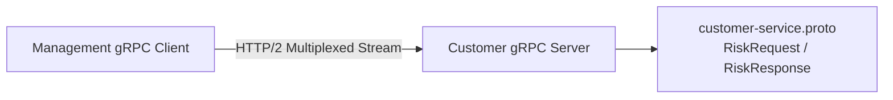

# Technical Deep Dive: Appendix - Spring gRPC Microservices & Protocol Buffers

## 1. Architectural Overview
The gRPC appendix covers high-performance binary inter-service RPC communication using the official **Spring gRPC 1.0.0** starter over HTTP/2.



## 2. Core Implementation
- **Protobuf Contract (`customer-service.proto`)**:
  ```protobuf
  syntax = "proto3";
  option java_multiple_files = true;
  option java_package = "com.apress.prospringboot4.customer.grpc";

  service CustomerRiskService {
    rpc AssessRisk (RiskRequest) returns (RiskResponse);
  }
  ```
- **Service Implementation**:
  - `CustomerRiskGrpcService` extends `CustomerRiskServiceImplBase` and implements reactive/blocking RPC handlers.
- **Client Configuration**:
  - `GrpcClientConfig` wires stub channels with connection pooling and deadline timeouts.

## 3. Build & Verification
```bash
# Customer (Maven)
cd appendix/grpc/customer && mvn compile -DskipTests

# Management (Gradle)
cd appendix/grpc/management && bash ./gradlew classes
```
