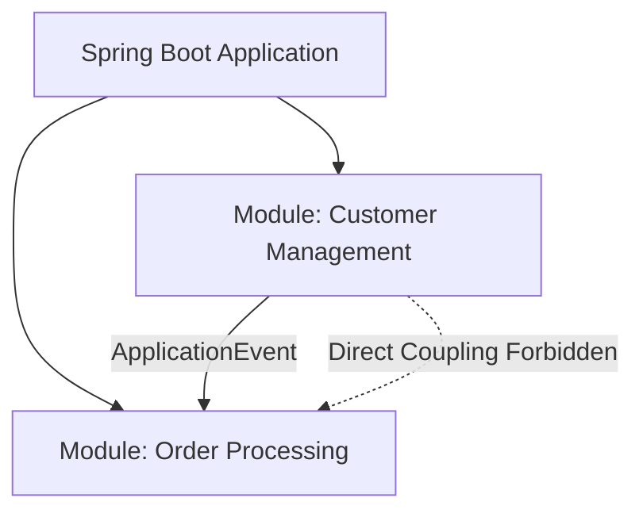

# Technical Deep Dive: Appendix - Spring Modulith Architecture

## 1. Architectural Overview
Spring Modulith enables structuring monolithic Spring Boot applications into well-defined, domain-aligned architectural modules with verified boundaries and event-driven intra-module communication.

## 2. Key Capabilities
- **Architectural Verification**: `ApplicationModules.of(Application.class).verify()` asserts that internal package boundaries are not breached.
- **Event Publication Registry**: Guarantees at-least-once delivery of intra-module domain events via transactional outbox patterns.
- **Living Documentation**: Automatically generates C4 architecture diagrams and component documentation from code metadata.
