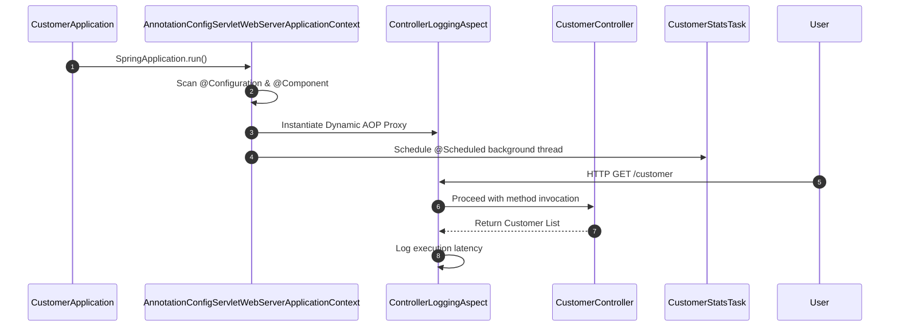

# Technical Deep Dive: Chapter 2 - Spring Boot Internals & ApplicationContext Lifecycle

## 1. Architectural Overview
Chapter 2 explores the core mechanics of the Spring Boot `ApplicationContext`, Bean Lifecycle, Aspect-Oriented Programming (AOP), custom configuration properties binding, and scheduled tasks.



## 2. Key Component Deep Dive
### AOP Execution Interception (`ControllerLoggingAspect`)
- Uses `@Aspect` and `@Component` with an `@Around("execution(* com.apress.crm.customer.*Controller.*(..))")` pointcut.
- Measures and logs exact controller method latency without modifying business logic.

### Configuration Properties Binding (`CrmProperties`)
- Declares `@ConfigurationProperties(prefix = "crm")`.
- Demonstrates immutable property binding with `@ConstructorBinding` and validation rules (`@Validated`).

### Background Scheduling (`CustomerStatsTask`)
- Enabled via `@EnableScheduling`.
- Periodically executes repository analytics using `@Scheduled(fixedRate = 30000)`.

## 3. Build & Verification
```bash
cd chapters/chapter-02-internals/customer
mvn compile -DskipTests
mvn test
```

## 4. Engineering Insights
- Spring Boot 4 initializes proxy beans with CGLIB/byte-buddy by default.
- Prefer constructor-bound `@ConfigurationProperties` over `@Value` for strong typing, testability, and IDE autocomplete support.
