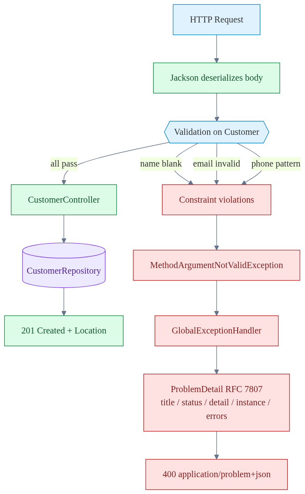
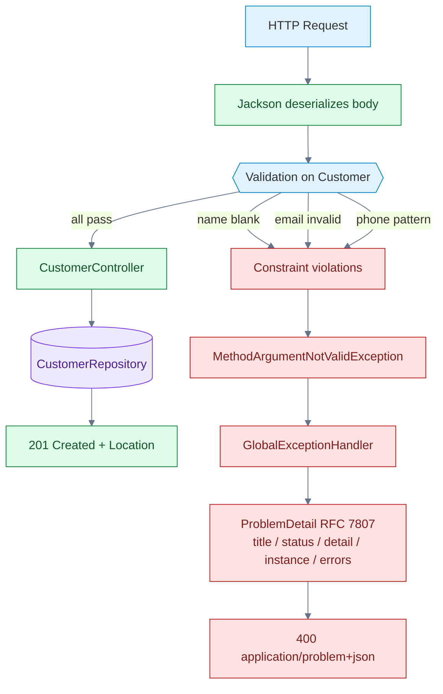

# Technical Deep Dive: Chapter 3 - Web Development, Validation & RFC 7807

## 1. Architectural Overview
Chapter 3 focuses on enterprise RESTful API engineering: content negotiation, JSR-380 input validation, and RFC 7807 Problem Details for standardized HTTP error responses.



<details>
<summary>Mermaid source (re-renderable)</summary>



</details>

## 2. Implementation Mechanics
- **Model Validation**:
  ```java
  public record Customer(
      UUID id,
      @NotBlank(message = "First name is mandatory") String firstName,
      @NotBlank(message = "Last name is mandatory") String lastName,
      @Email(message = "Invalid email format") String email
  ) {}
  ```
- **RFC 7807 ProblemDetail Integration**:
  - Implements `@ExceptionHandler(MethodArgumentNotValidException.class)`.
  - Constructs `ProblemDetail` with URI type definitions and field-level validation violation summaries.

## 3. Build & Test
```bash
cd chapters/chapter-03-web-development/customer
mvn clean test
```

## 4. Key Takeaways
- Standardization of error contracts across microservices eliminates custom error schema drift.
- Never return raw stack traces or internal exception class names in production responses.
