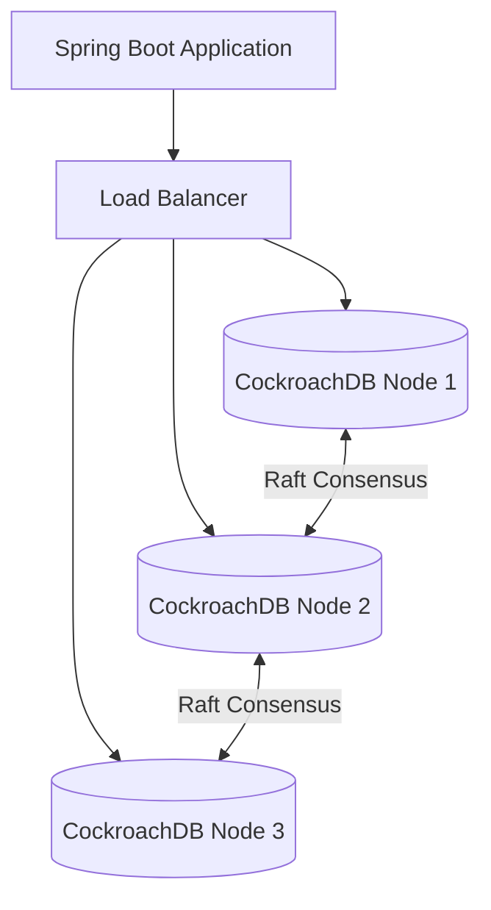

# Technical Deep Dive: Chapter 8 - NewSQL & Distributed Relational Databases

## 1. Architectural Overview
Chapter 8 explores distributed relational databases (**CockroachDB / YugabyteDB**), focusing on horizontal scalability, distributed transactions, Raft consensus, and transient failure recovery.



## 2. Technical Resilience Strategies
- **Retryable Transactions**: Configures retry interceptors for PostgreSQL 40001 (serialization failure) error codes common in distributed MVCC conflict resolution.
- **Connection Load Balancing**: Distributes connections across multi-node clusters using multi-host JDBC connection strings.

## 3. Build & Verification
```bash
cd chapters/chapter-08-newsql-distributed/customer && mvn compile -DskipTests
cd ../management && bash ./gradlew classes
```
