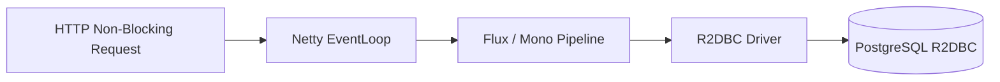

# Technical Deep Dive: Chapter 9 - Reactive Streams with R2DBC & WebFlux

## 1. Architectural Overview
Chapter 9 details fully non-blocking, asynchronous reactive architectures using **Spring Data R2DBC** and **Spring WebFlux** running on Project Reactor and Netty.



## 2. Technical Mechanisms
- **Reactive Repositories**: Extends `R2dbcRepository<Customer, UUID>` returning `Mono<Customer>` and `Flux<Customer>`.
- **Backpressure Handling**: Seamless downstream demand propagation across Netty worker loops.
- **DatabaseClient Fluent API**: Dynamic query construction using reactive `DatabaseClient`.

## 3. Build & Verification
```bash
cd chapters/chapter-09-reactive/customer && mvn test
cd ../management && bash ./gradlew test
```
