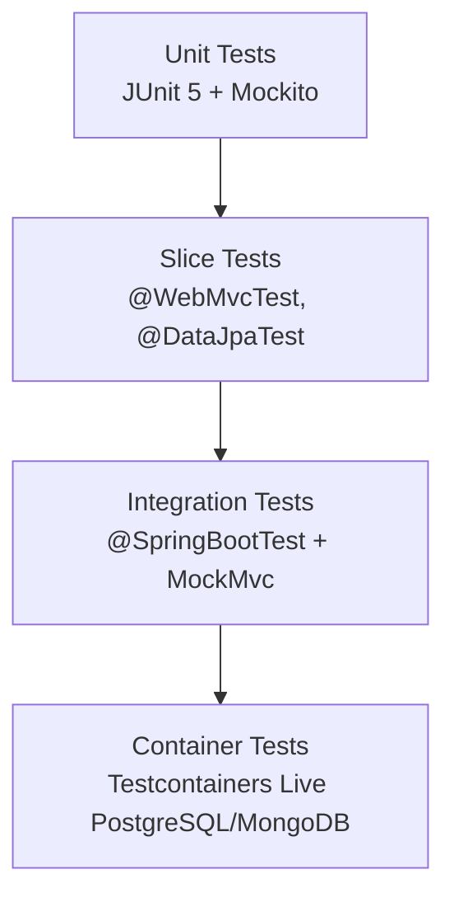

# Technical Deep Dive: Chapter 10 - Enterprise Testing Strategies

## 1. Architectural Overview
Chapter 10 provides a complete testing taxonomy: Unit testing (JUnit 5, Mockito), Slice testing (`@WebMvcTest`, `@DataJpaTest`), Full-stack Integration testing (`@SpringBootTest`), and Live Infrastructure testing with **Testcontainers**.



## 2. Key Testing Patterns
- **Testcontainers Dynamic Properties**:
  ```java
  @Container
  static PostgreSQLContainer<?> postgres = new PostgreSQLContainer<>("postgres:16-alpine");

  @DynamicPropertySource
  static void configureProperties(DynamicPropertyRegistry registry) {
      registry.add("spring.datasource.url", postgres::getJdbcUrl);
      registry.add("spring.datasource.username", postgres::getUsername);
      registry.add("spring.datasource.password", postgres::getPassword);
  }
  ```
- **WebTestClient**: Validates non-blocking reactive endpoints with fluent assertions.

## 3. Build & Verification
```bash
cd chapters/chapter-10-testing/customer && mvn test
cd ../management && bash ./gradlew test
```
