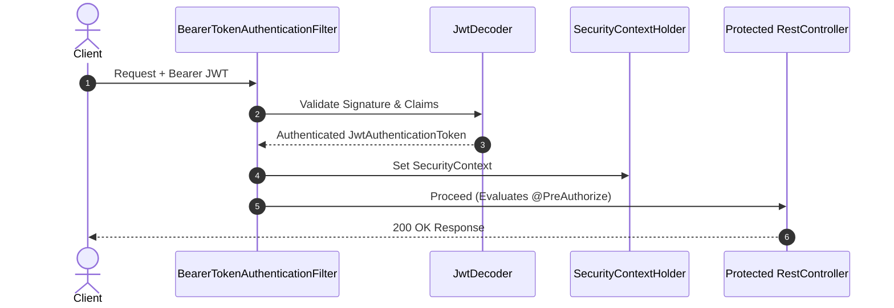

# Technical Deep Dive: Chapter 11 - Spring Security 7 & OAuth2 Architecture

## 1. Architectural Overview
Chapter 11 implements zero-trust modern application security using **Spring Security 7**, component-based `SecurityFilterChain` configurations, stateless JWT token authentication, and role-based method security.



## 2. Key Implementations
- **Stateless Filter Chain**:
  ```java
  @Bean
  public SecurityFilterChain securityFilterChain(HttpSecurity http) throws Exception {
      return http
          .csrf(CsrfConfigurer::disable)
          .sessionManagement(s -> s.sessionCreationPolicy(SessionCreationPolicy.STATELESS))
          .authorizeHttpRequests(auth -> auth
              .requestMatchers("/public/**").permitAll()
              .requestMatchers("/api/admin/**").hasRole("ADMIN")
              .anyRequest().authenticated())
          .oauth2ResourceServer(oauth2 -> oauth2.jwt(Customizer.withDefaults()))
          .build();
  }
  ```
- **Method Security**: Enables `@EnableMethodSecurity` and enforces fine-grained `@PreAuthorize("hasRole('ADMIN')")`.

## 3. Build & Verification
```bash
cd chapters/chapter-11-security/customer && mvn test
cd ../management && bash ./gradlew test
```
