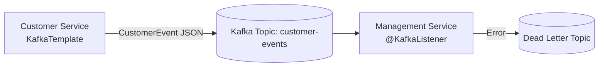

# Technical Deep Dive: Chapter 12 - Event-Driven Messaging with Kafka & RabbitMQ

## 1. Architectural Overview
Chapter 12 covers asynchronous event-driven architectures, microservice domain events, consumer groups, partition balancing, and resilient message processing with **Apache Kafka** and **RabbitMQ**.



## 2. Key Implementations
- **Producer**: Uses `KafkaTemplate<String, CustomerEvent>` to publish strongly-typed JSON domain events.
- **Consumer Group**: Declares `@KafkaListener(topics = "customer-events", groupId = "crm-management")`.
- **Dead-Letter Recovery**: Configures `DefaultErrorHandler` with backoff and DLT routing for poison-pill handling.

## 3. Build & Verification
```bash
cd chapters/chapter-12-messaging/customer && mvn test
cd ../management && bash ./gradlew test
```
