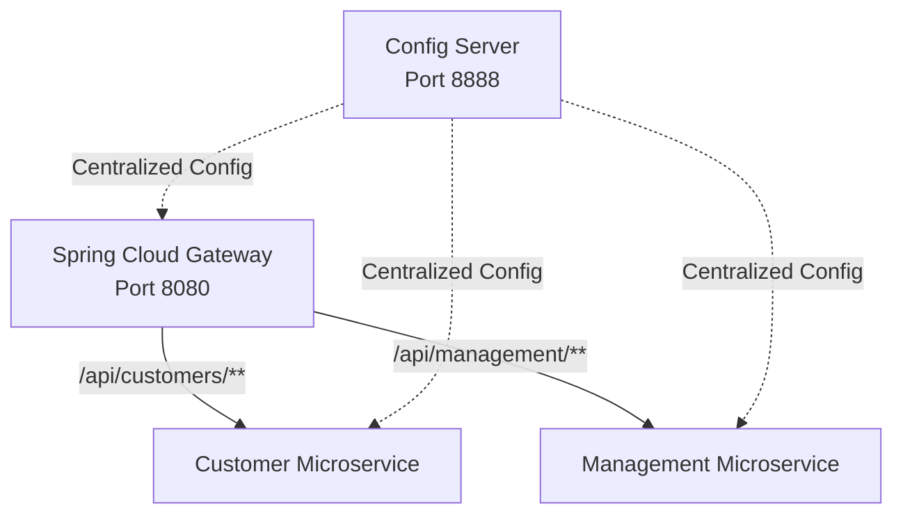

# Technical Deep Dive: Chapter 15 - Spring Cloud Microservices & Distributed Gateway

## 1. Architectural Overview
Chapter 15 designs a production-grade distributed microservice network featuring **Spring Cloud Gateway**, **Spring Cloud Config Server**, client-side load balancing, and distributed resilience.



## 2. Microservice Components
1. **`api-gateway`**: Non-blocking gateway routes requests, performs path rewrites, and attaches security headers.
2. **`config-server`**: Serves version-controlled application configuration across all active profiles.
3. **`crm-tests`**: Integration test harness validating cross-service routing and contract consistency.

## 3. Build & Verification
```bash
cd chapters/chapter-15-spring-cloud/api-gateway && mvn compile -DskipTests
cd ../config-server && mvn compile -DskipTests
cd ../customer && mvn compile -DskipTests
cd ../management && bash ./gradlew classes
```
