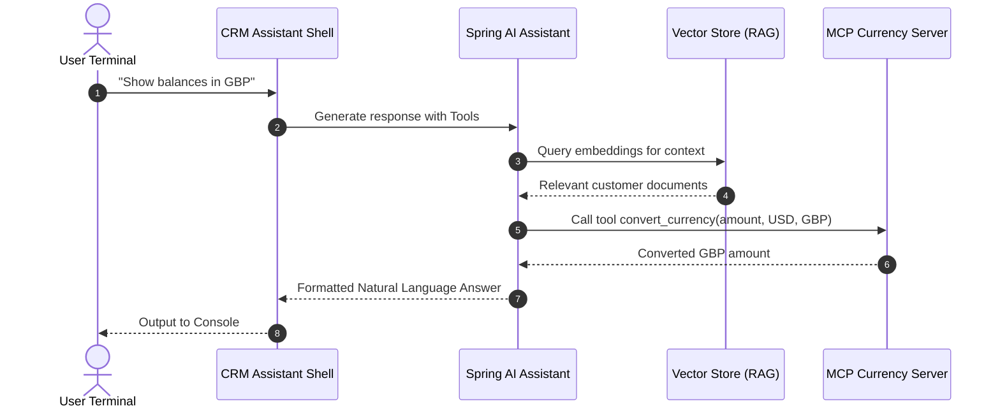

# Technical Deep Dive: Chapter 16 - Spring AI, RAG & Model Context Protocol (MCP)

## 1. Architectural Overview
Chapter 16 represents the generative AI frontier in Spring Boot 4: **Spring AI (1.0.0-M5)**, Retrieval-Augmented Generation (RAG), Vector Stores, Tool/Function Calling, standalone **Model Context Protocol (MCP)** servers, and interactive **Spring Shell** CLI interfaces.



## 2. Technical Components
- **`crm-assistant-shell`**: Interactive terminal client developed with Spring Shell for natural-language customer management.
- **`mcp-currency-server`**: Standardized Model Context Protocol server exposing currency tools via JSON-RPC.
- **`management` AI Engine**: Implements `DatabaseAgentService`, `RAGService`, and `@Tool` definitions (`R2dbcQueryTool`, `CustomerTools`).

## 3. Build & Verification
```bash
cd chapters/chapter-16-spring-ai/crm-assistant-shell && bash ./gradlew classes
cd ../customer && mvn compile -DskipTests
cd ../management && bash ./gradlew classes
cd ../mcp-currency-server && bash ./gradlew classes
```
