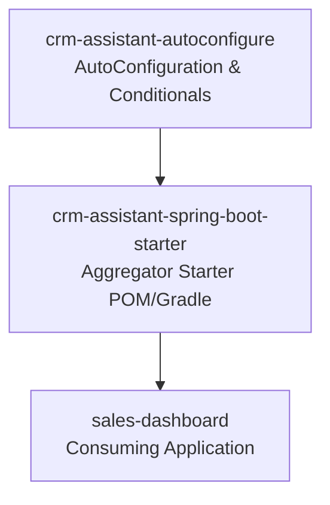

# Technical Deep Dive: Chapter 17 - Custom Starters & Auto-Configuration

## 1. Architectural Overview
Chapter 17 demonstrates the enterprise pattern for modularizing cross-cutting features into reusable **Spring Boot Starters**, following the official two-module starter architecture.



## 2. Architecture of the Custom Starter
1. **`crm-assistant-autoconfigure`**:
   - Declares `@AutoConfiguration`.
   - Uses conditions: `@ConditionalOnClass(CrmAssistant.class)`, `@ConditionalOnProperty(prefix = "crm.assistant", name = "enabled")`.
   - Registers `@EnableConfigurationProperties(CrmAssistantProperties.class)`.
2. **`crm-assistant-spring-boot-starter`**:
   - Bundles all required runtime dependencies into a clean single artifact.
3. **`sales-dashboard`**:
   - Consumer application that imports the starter and automatically gets autowired assistant capabilities without manual configuration.

## 3. Build & Verification
```bash
cd chapters/chapter-17-extending/crm-assistant-starter && bash ./gradlew classes
cd ../sales-dashboard && bash ./gradlew classes
```
